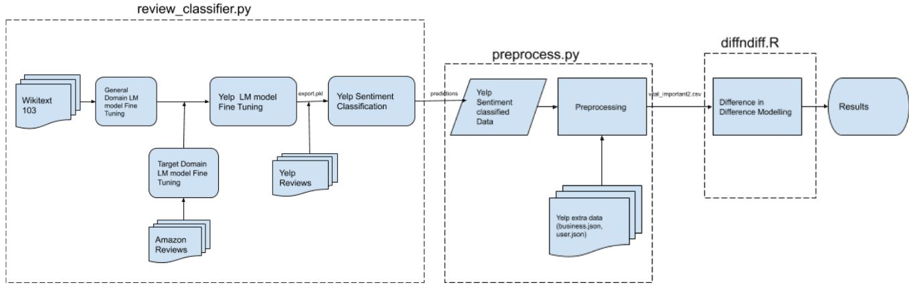

The folder consists of Several files

[review_classifier.py](review_classifier.py): Deep learning model script which produces export.pkl file to infer upon the yelp data

[preprocess.py](preprocess.py): preprocessing script to convert classified data into required cross sectional format for difference in difference modelling 

[yelpdata_explore.ipynb](yelpdata_explore.ipynb): Yelp data variable analysis

[export.pkl](export.pkl): load this pickle file using load_learner method from Fastai and get prediction classifications for data 

[diffndiff.R](diffndiff.R): R file to plot assumptions and build difference in difference models

[data](/data/): This folder consists of processed data from predictions and Yelp data files

[images](/images/): This folder consists of difference in difference assumption trend plots and project flowchart.

### Project Flowchart

